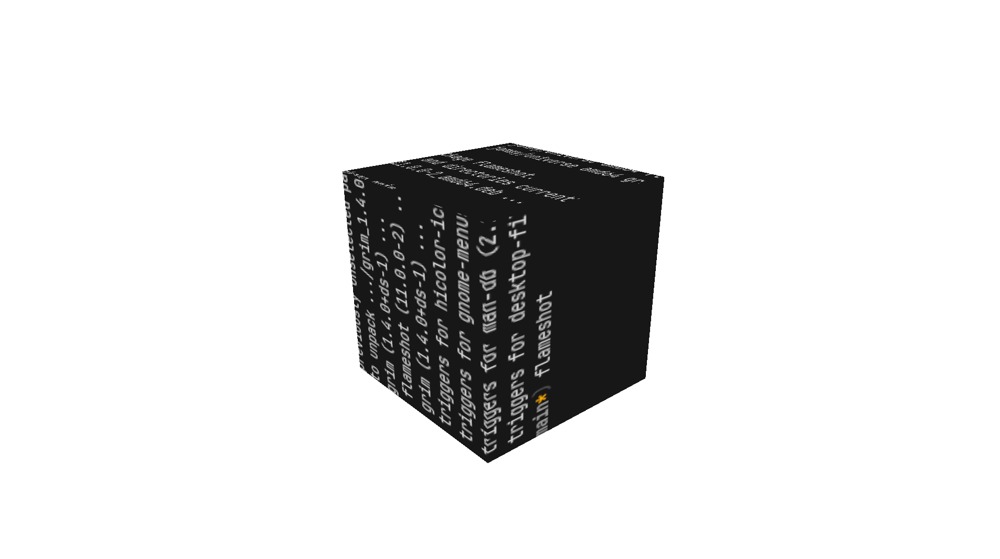

# Miye Game Engine

Miye is a simple, lightweight .obj file renderer.

## Quick Links
- [Images](#Images)
- [Installation](#installing)
- [Examples](#examples)

## Images



## Installing

### Prerequisites

- [Godot Steamworks (4.2.2)](https://github.com/GodotSteam/GodotSteam/releases/tag/v4.7)

```bash
git clone https://github.com/vasiltop/miye
cd miye
cargo run
```

## Examples
Examples on how to use Miye can be found in the [examples](examples) directory.

```bash
cargo run --example cube
```
